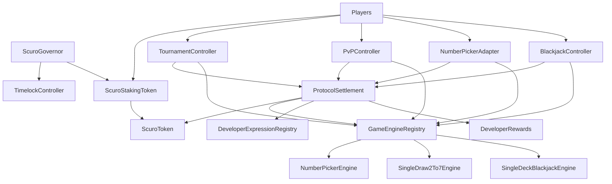

# Scuro

Scuro is a generalized on-chain gaming protocol built around a shared token, shared settlement layer, developer rewards, and governance-controlled protocol configuration.

## What Scuro Includes

- One protocol token for gameplay, staking, governance, and rewards: `ScuroToken` (`SCU`)
- One staking/voting asset: `ScuroStakingToken` (`sSCU`)
- Governance with `ScuroGovernor` + `TimelockController`
- Shared protocol services:
  - `ProtocolSettlement`
  - `GameEngineRegistry`
  - `DeveloperExpressionRegistry`
  - `DeveloperRewards`
- Controllers:
  - `BlackjackController`
  - `TournamentController`
  - `PvPController`
  - `NumberPickerAdapter`
- Engines:
  - `NumberPickerEngine`
  - `SingleDraw2To7Engine`
  - `SingleDeckBlackjackEngine`
- Local deployment and smoke tooling:
  - `script/DeployLocal.s.sol`
  - `script/e2e_deploy_smoke.sh`
- A layered end-to-end suite under `test/e2e`

## Protocol Model

### Token and settlement

`ScuroToken` is the economic unit of the protocol.

- Players use SCU for wagers and entry fees.
- Settlement burns wagers and mints rewards.
- Developer rewards are denominated in SCU.
- Governance voting power comes from staked SCU (`sSCU`), not raw wallet balances.

`ProtocolSettlement` is the only protocol-level contract that controllers use for value movement.

- Burns player wagers through allowance-based `burnFrom`
- Mints player rewards
- Records developer accruals for an engine plus expression token pair

### Developer rewards

`DeveloperRewards` tracks inflationary developer rewards by epoch.

- Settlement accrues developer rewards against the current epoch.
- Epochs close on a time schedule.
- Developers claim rewards after epoch close.
- Reward rates are defined per deployed engine in `GameEngineRegistry`.
- Reward recipients are chosen per transaction through `DeveloperExpressionRegistry`.

### Registries

`GameEngineRegistry` is the routing and policy layer for engine deployments.

Each engine entry stores:

- engine type
- verifier address
- config hash
- developer reward bps
- active flag
- compatibility flags for solo / PvP / tournament

`DeveloperExpressionRegistry` is a permissionless ERC721 registry for distributable engine expressions.

Each expression token stores:

- engine type
- expression hash
- metadata URI
- active flag
- original minter

The registry does not store a fixed payout wallet for an engine. Reward attribution comes from the current owner of the supplied expression NFT.

Controllers take an `expressionTokenId` on each create/play/start entrypoint, persist it with controller state, and later reuse that stored token during settlement. `ProtocolSettlement` validates that the expression token is active, matches the target engine type, and accrues rewards to `ownerOf(expressionTokenId)` at settlement time.

### Governance

`ScuroGovernor` + `TimelockController` govern live protocol configuration.

Current governance-tested flows include:

- staking and delegation
- proposal creation
- voting
- queue / execute through timelock
- live parameter updates such as developer reward epoch duration

### Controllers and engines

Scuro separates orchestration from game logic.

- `TournamentController` manages tournament-style sessions for registered tournament engines and requires an expression token ID at tournament creation.
- `PvPController` manages direct competitive sessions for registered PvP engines and requires an expression token ID at session creation.
- `NumberPickerAdapter` is the solo-play entrypoint for the VRF-backed number picker engine and requires an expression token ID on play.
- `BlackjackController` is the solo-play entrypoint for the zk-backed blackjack engine and requires an expression token ID on hand start.

Current example engines:

- `NumberPickerEngine`
  - single-player
  - burn wager, resolve randomness, mint reward if won
- `SingleDraw2To7Engine`
  - 2-player single-draw poker
  - supports tournament and PvP controller flows
  - uses real Groth16 verifier bundles for initial deal, draw resolution, and showdown
- `SingleDeckBlackjackEngine`
  - single-player blackjack with a fresh single deck each hand
  - uses real Groth16 verifier bundles for deal, action resolution, and showdown
  - settled through `BlackjackController`

## Architecture

See [architecture_overview.md](./architecture_overview.md) for the higher-level diagram. The active contract graph is:



## Repository Layout

```text
.
├── foundry.toml
├── src/
│   ├── ScuroToken.sol
│   ├── ScuroStakingToken.sol
│   ├── ScuroGovernor.sol
│   ├── ProtocolSettlement.sol
│   ├── GameEngineRegistry.sol
│   ├── DeveloperExpressionRegistry.sol
│   ├── DeveloperRewards.sol
│   ├── controllers/
│   ├── engines/
│   ├── interfaces/
│   ├── libraries/
│   └── mocks/
├── test/
│   ├── ProtocolCore.t.sol
│   ├── DeveloperExpressionRegistry.t.sol
│   ├── NumberPickerAdapter.t.sol
│   ├── TournamentController.t.sol
│   └── e2e/
├── script/
│   ├── DeployLocal.s.sol
│   └── e2e_deploy_smoke.sh
├── docs/
├── lib/
└── archive/
```

### Active vs archived

- `src/`, `test/`, `script/`, `foundry.toml`, and `lib/` are the active protocol package.
- `archive/` contains legacy protocol directories kept for reference only.

## Getting Started

### Prerequisites

- Foundry (`forge`, `cast`, `anvil`)
- Bun
- `bash` for the deploy smoke helper

### Build

```bash
forge build --offline
```

### Build zk artifacts

```bash
bun run --cwd zk build
```

See [docs/local-deployment-testing.md](./docs/local-deployment-testing.md) for the full local deployment and testing workflow, including when to rebuild artifacts versus only validating committed zk outputs.

### Run all tests

Use `--offline` in this environment. It avoids a local Foundry issue around external trace/signature lookup.

```bash
forge test --offline
```

### Run only the layered E2E suite

```bash
forge test --match-path 'test/e2e/*.t.sol' --offline
```

## Local Deployment

### Deploy the full local stack manually

Start Anvil in one terminal:

```bash
anvil
```

Deploy in another:

```bash
PRIVATE_KEY=0xac0974bec39a17e36ba4a6b4d238ff944bacb478cbed5efcae784d7bf4f2ff80 \
forge script script/DeployLocal.s.sol:DeployLocal \
  --rpc-url http://127.0.0.1:8545 \
  --broadcast
```

The local deploy script does the following:

- deploys the token, staking token, timelock, governor, engine registry, developer expression registry, developer rewards, settlement, controllers, and example engines
- deploys VRF plus real poker and blackjack Groth16 verifier bundles
- grants required minting / settlement / controller / adapter roles
- registers all three example engines in the engine registry
- mints example developer expression NFTs for number picker, poker, and blackjack
- seeds:
  - admin
  - player 1
  - player 2
  - solo developer
  - poker developer

### Run the deploy smoke

```bash
./script/e2e_deploy_smoke.sh
```

The smoke script:

- validates committed zk artifacts with Bun
- starts Anvil
- runs the local deploy script
- verifies deploy-time roles, registry state, and expression token ownership
- checks seeded balances
- performs one post-deploy staking interaction
- runs one real-proof poker tournament hand using a poker expression token
- runs one real-proof blackjack hand using a blackjack expression token

## Developer Rewards Flow

Developer rewards are split across two protocol components:

- `GameEngineRegistry` defines the reward rate for each engine deployment.
- `DeveloperExpressionRegistry` defines which developer-owned expression NFT is being used on a given transaction.

The end-to-end accrual path is:

1. A developer mints a transferable expression NFT for an engine type.
2. A controller entrypoint receives an `expressionTokenId` from the caller or operator.
3. The controller stores that token ID with the play/session/tournament state.
4. On settlement, `ProtocolSettlement` validates engine type compatibility and active status.
5. Settlement computes the accrual from the engine’s `developerRewardBps`.
6. `DeveloperRewards` books the reward to the current `ownerOf(expressionTokenId)`.

Transferred expression NFTs redirect any accrual that has not yet been booked. In immediate-settlement flows like number picker, that means future plays only. In multi-step flows like tournament, PvP, and blackjack, the owner at final settlement receives the accrual for that in-flight session. Already-booked epoch accruals remain claimable by the wallet that received them at settlement time.

### Expression Integration Reference

The current controller entrypoints are:

- `NumberPickerAdapter.play(uint256 wager, uint256 selection, bytes32 playRef, uint256 expressionTokenId)`
- `BlackjackController.startHand(uint256 wager, bytes32 playRef, bytes32 playerKeyCommitment, uint256 expressionTokenId)`
- `TournamentController.createTournament(uint256 entryFee, uint256 rewardPool, address gameEngine, uint256 startingStack, bytes engineConfig, uint256 expressionTokenId)`
- `PvPController.createSession(address gameEngine, address player1, address player2, uint256 stake, uint256 rewardPool, uint256 startingStack, bytes engineConfig, uint256 expressionTokenId)`

Later lifecycle calls reuse the stored token ID:

- number picker: `requestExpressionTokenId(requestId)`
- blackjack: `sessionExpressionTokenId(sessionId)`
- tournament: `tournaments(tournamentId).expressionTokenId`
- PvP: `sessions(sessionId).expressionTokenId`

### Operational Caveat

Expression compatibility is enforced when settlement books developer accrual, not when a multi-step session is first created. For tournament, PvP, and blackjack flows, a wrong, unknown, mismatched, or later-deactivated expression token can therefore block settlement until the referenced token state is corrected.

## Testing Strategy

Scuro uses two layers of tests:

See [docs/local-deployment-testing.md](./docs/local-deployment-testing.md) for the exact commands, prerequisites, and the mapping from user stories to suites.

### Focused contract tests

These target specific protocol areas:

- `test/ProtocolCore.t.sol`
- `test/DeveloperExpressionRegistry.t.sol`
- `test/NumberPickerAdapter.t.sol`
- `test/TournamentController.t.sol`
- `test/BlackjackController.t.sol`

### Layered E2E tests

These live under `test/e2e`.

- `SmokeE2E.t.sol`
  - protocol bootstrapping
  - role wiring
  - registry compatibility
  - expression ownership wiring
  - one minimal happy path per major subsystem
- `UserFlowsE2E.t.sol`
  - full valid user journeys across solo, tournament, PvP, developer epoch, expression transfer, and governance flows
- `AbusePathsE2E.t.sol`
  - replay protection
  - unauthorized access
  - inactive engines and inactive expressions
  - bad timing
  - invalid proofs
  - duplicate claims / settlements

The E2E completeness gate is documented in [test/e2e/MATRIX.md](./test/e2e/MATRIX.md).

## Main Contracts

### Core

- `src/ScuroToken.sol`
- `src/ScuroStakingToken.sol`
- `src/ScuroGovernor.sol`
- `src/ProtocolSettlement.sol`
- `src/GameEngineRegistry.sol`
- `src/DeveloperExpressionRegistry.sol`
- `src/DeveloperRewards.sol`

### Controllers

- `src/controllers/BlackjackController.sol`
- `src/controllers/TournamentController.sol`
- `src/controllers/PvPController.sol`
- `src/controllers/NumberPickerAdapter.sol`

### Engines

- `src/engines/NumberPickerEngine.sol`
- `src/engines/SingleDraw2To7Engine.sol`
- `src/engines/SingleDeckBlackjackEngine.sol`

### Interfaces and helpers

- `src/interfaces/`
- `src/libraries/Groth16ProofCodec.sol`
- `src/mocks/`
- `zk/`

## Example User Flows Covered Today

- player stakes SCU and gains voting power
- governance changes developer epoch duration
- player performs solo number-picker play with an expression token
- developer accrues and claims rewards after epoch close
- transferred expression NFTs redirect later-booked rewards without moving already-booked balances
- tournament match settles through poker engine with an expression token
- PvP session settles through poker engine with an expression token
- solo blackjack hand settles through blackjack engine with an expression token
- inactive engines and inactive expressions block invalid settlement flows
- poker timeout, fold, tie, and verifier-rejection paths are exercised

## Notes

- The root package is the only supported build target.
- Archived directories are intentionally excluded from current testing and deployment.
- Generated artifacts live under `out/`, `cache/`, and `broadcast/` and are ignored by git where appropriate.

## Recommended Commands

```bash
# Build
forge build --offline

# Full test suite
forge test --offline

# E2E only
forge test --match-path 'test/e2e/*.t.sol' --offline

# Deploy smoke
./script/e2e_deploy_smoke.sh
```

## License

Unless a file header or [THIRD_PARTY_NOTICES.md](./THIRD_PARTY_NOTICES.md) says
otherwise, this repository is proprietary and public for inspection only. It is
not licensed for personal, internal, academic, or commercial use. See
[LICENSE](./LICENSE).
