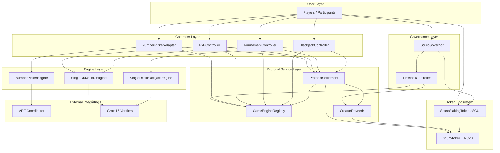

# Scuro Protocol Architecture

Scuro is a shared settlement and governance layer that hosts three example game engines:

- `NumberPickerEngine` via `NumberPickerAdapter`
- `SingleDraw2To7Engine` via `TournamentController` and `PvPController`
- `SingleDeckBlackjackEngine` via `BlackjackController`

Two of the three engines are powered by zk proof verification:

- poker (`SingleDraw2To7Engine`)
- blackjack (`SingleDeckBlackjackEngine`)

## High-Level Architecture

## Component Breakdown

### Controllers

- `NumberPickerAdapter` handles solo VRF-backed play and immediate settlement finalization.
- `TournamentController` creates tournaments, starts poker matches, and settles reported tournament outcomes.
- `PvPController` creates direct two-player poker sessions and settles completed matches.
- `BlackjackController` opens blackjack hands, burns any extra wager for doubles/splits, and settles completed hands.

### Protocol services

- `ProtocolSettlement` is the only protocol-level contract allowed to burn player wagers, mint player rewards, and accrue creator rewards.
- `GameEngineRegistry` stores engine metadata, creator reward rates, compatibility flags, and active status.
- `CreatorRewards` accumulates creator inflation by epoch and handles post-close claims.

### Governance and tokens

- `ScuroToken` (`SCU`) is the protocol asset used for wagers, rewards, and creator payouts.
- `ScuroStakingToken` (`sSCU`) wraps staked SCU and provides governance voting power.
- `ScuroGovernor` plus `TimelockController` govern live protocol configuration such as creator reward epoch duration.

### Engine model

- `NumberPickerEngine` is the simple solo engine and depends on a VRF coordinator mock in local/dev flows.
- `SingleDraw2To7Engine` is the shared poker engine for tournament and PvP flows. Controllers may initialize games; the zk coordinator proves the initial deal, draw resolution, and showdown.
- `SingleDeckBlackjackEngine` is the solo zk blackjack engine. The controller opens sessions while the zk coordinator proves the initial deal, action resolution, and showdown.

## Operational Notes

- Registry deactivation blocks new poker tournaments and new PvP sessions.
- Tournament games that were already started can still settle after deactivation so rewards are not stranded.
- The zk-backed engines still rely on an off-chain coordinator for proof generation and submission.
