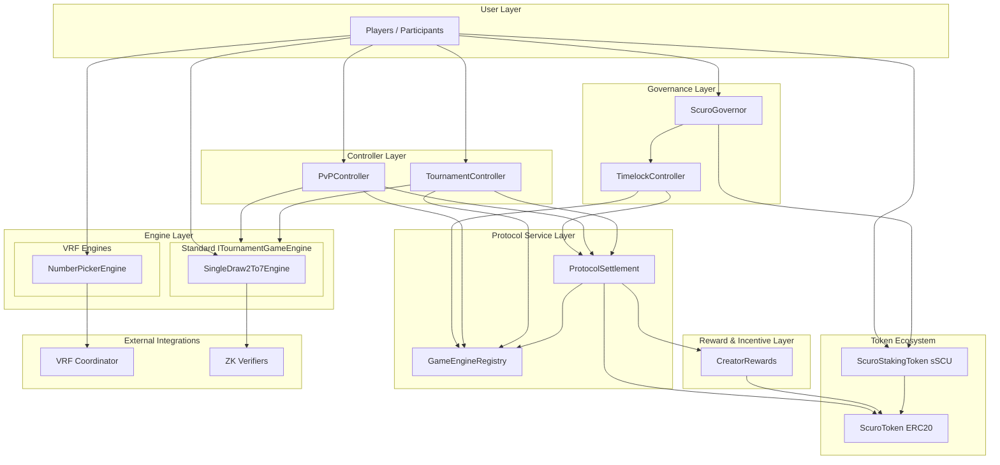

# Scuro Protocol Architecture

The Scuro protocol is a decentralized gaming ecosystem that facilitates trustless gameplay, automated settlement, and incentives for game creators.

## High-Level Architecture

## Component Breakdown

### 1. Controllers (`PvPController`, `TournamentController`)
These are the entry points for different game modes. They handle:
- Session/Tournament lifecycle management.
- Authorization and role-based access.
- Coordination between Settlement and Engines.

### 2. ProtocolSettlement
The financial orchestrator of the protocol. It handles:
- **Wager Burning**: Deducting `ScuroToken` from players upon game start.
- **Reward Minting**: Distributing rewards to winners upon game conclusion.
- **Creator Accruals**: Automatically calculating and recording rewards for game engine creators based on protocol activity.

### 3. GameEngineRegistry
A central repository of metadata for all supported games. It tracks:
- Engine addresses and types.
- Creator configurations (for reward distribution).
- Active status and supported game modes (PvP, Tournament, Solo).

### 4. CreatorRewards
Manages the distribution of incentives to engine creators.
- **Epoch-based Accrual**: Rewards are tracked in time-bound epochs.
- **Trustless Claims**: Creators can claim their accrued `ScuroToken` rewards once an epoch is closed.

### 5. Governance Layer
- **ScuroGovernor**: The core DAO contract used for on-chain voting and proposal management.
- **TimelockController**: A delayed execution layer that ensures proposals are not executed immediately, giving the community time to react.
- **Voting Power**: Derived from `ScuroStakingToken` (sSCU) balances.

### 6. Token Ecosystem
- **ScuroToken (SCU)**: The primary utility token for wagers, rewards, and creator incentives.
- **ScuroStakingToken (sSCU)**: A staked version of SCU that grants voting power for protocol governance.

### 6. Game Engines
The core logic units that implement the `ITournamentGameEngine` (or custom) interfaces.
- **SingleDraw2To7Engine**: A sophisticated poker engine utilizing Zero-Knowledge (ZK) proofs for private state management.
- **NumberPickerEngine**: A randomness-based engine utilizing Chainlink VRF for provably fair outcomes.
