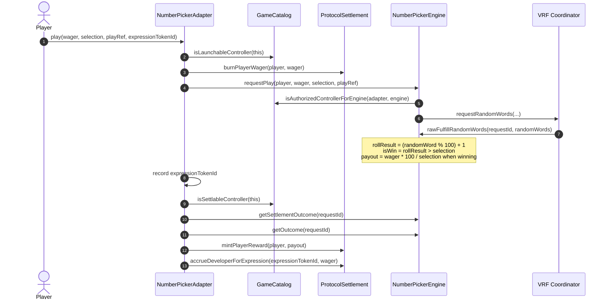
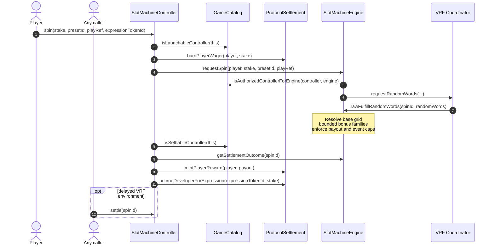
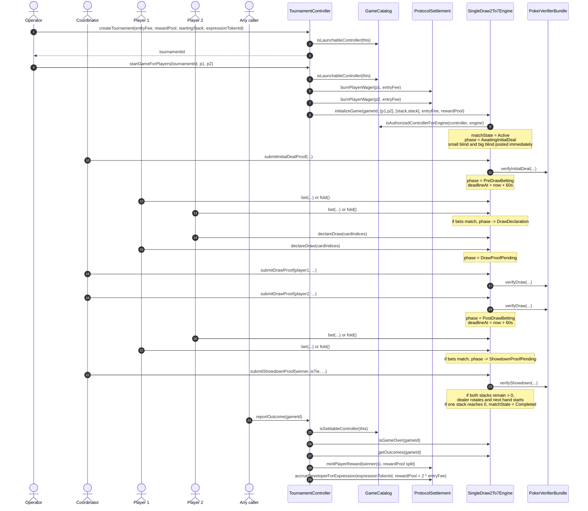
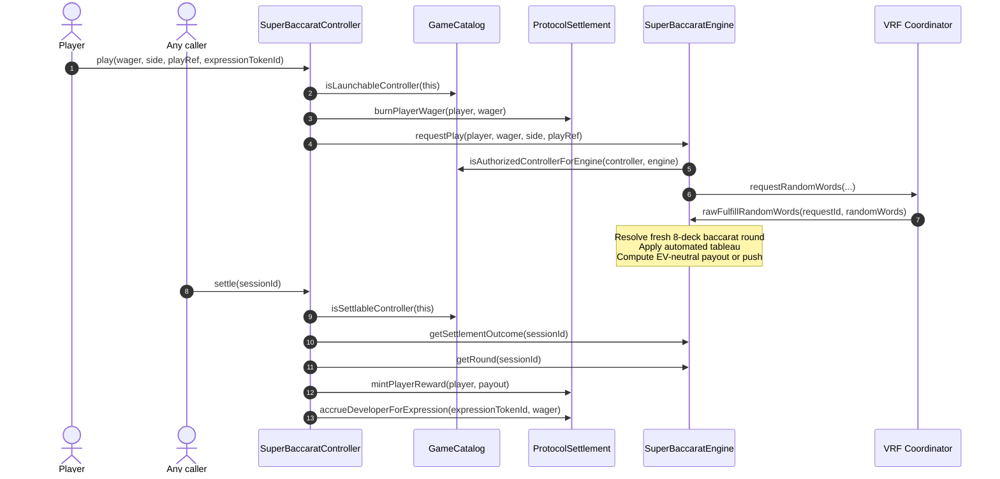
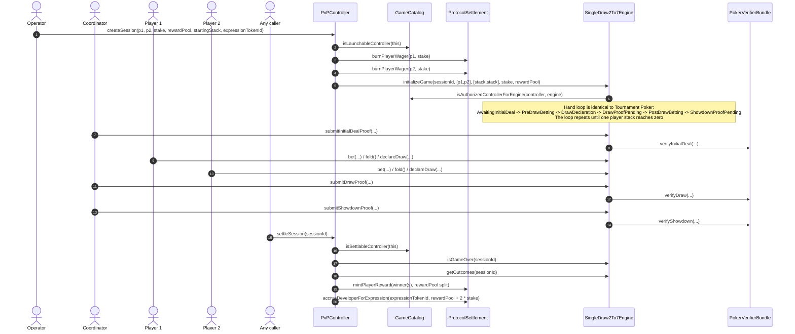
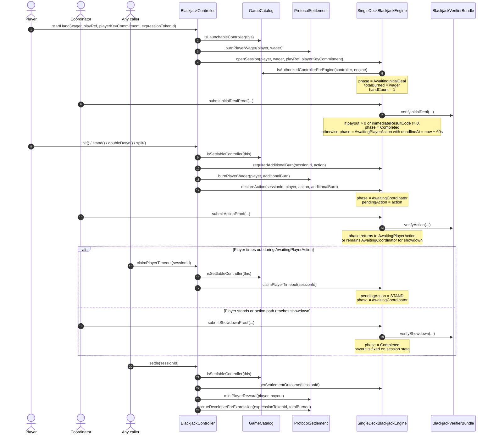
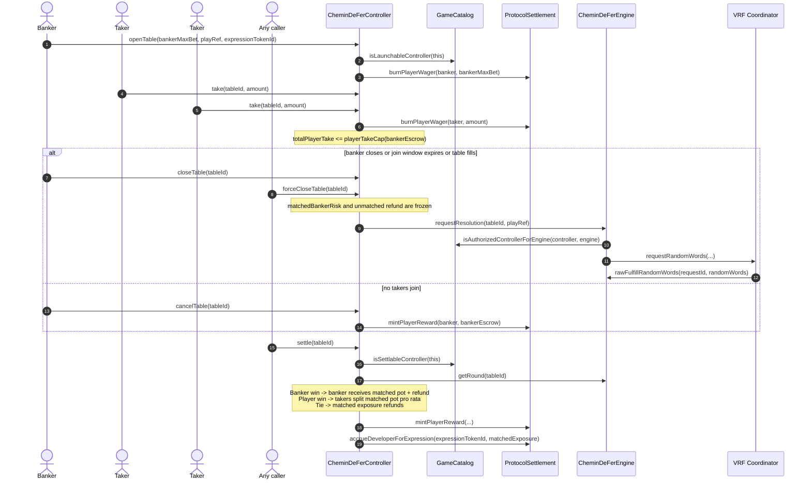

# Game Module User Flows

This guide captures the current controller and engine flows for each shipped game module in this repository. The diagrams describe the code paths that exist today, including where settlement happens, who is allowed to call each stage, and which off-chain or external component unblocks the next step.

## Current Module Map

| Module | Mode | Controller | Engine | External dependency | Local default config |
| --- | --- | --- | --- | --- | --- |
| NumberPicker | Solo | `NumberPickerAdapter` | `NumberPickerEngine` | VRF coordinator | auto-callback VRF mock |
| Slot Machine | Solo | `SlotMachineController` | `SlotMachineEngine` | VRF coordinator | governed presets (`base`, `free`, `pick`, `hold`) in tests |
| Super Baccarat | Solo | `SuperBaccaratController` | `SuperBaccaratEngine` | VRF coordinator | auto-callback VRF mock |
| Tournament Poker | Tournament | `TournamentController` | `SingleDraw2To7Engine` | coordinator + Groth16 proofs | SB `10`, BB `20`, blind interval `180s`, action window `60s` |
| PvP Poker | PvP | `PvPController` | `SingleDraw2To7Engine` | coordinator + Groth16 proofs | SB `10`, BB `20`, blind interval `180s`, action window `60s` |
| Chemin de Fer | PvP | `CheminDeFerController` | `CheminDeFerEngine` | VRF coordinator | join window `60s` |
| Blackjack | Solo | `BlackjackController` | `SingleDeckBlackjackEngine` | coordinator + Groth16 proofs | action window `60s` |

## NumberPicker

Key runtime notes:
- The player enters through `NumberPickerAdapter`, which burns the wager before asking the engine for randomness.
- Win logic is `rollResult > selection`; payout is `wager * 100 / selection`.
- In the default local setup, the VRF mock calls back immediately, so `play()` records the request and finalizes in one transaction.
- Developer accrual is based on the wager amount that was burned for the request.

## Slot Machine

Key runtime notes:
- The player enters through `SlotMachineController`, which burns the stake before asking the engine to launch a preset-driven spin.
- The engine stores immutable governed presets and resolves one atomic spin from a single randomness seed.
- The current engine supports a ways-based base game plus bounded `free spins`, `pick bonus`, and `hold-and-spin` feature families.
- Developer accrual is based on the original stake amount that was burned for the spin.

## Tournament Poker

Key runtime notes:
- `TournamentController` stores a reusable tournament configuration, then launches individual two-player games under that configuration.
- This is not a bracket manager. The controller does not track standings, rounds, or automatic advancement.
- `startingStack` is an internal chip stack for the poker engine. Settlement still pays the fixed `rewardPool`, not the final chip count.
- The poker engine loops hand-by-hand until one player stack reaches zero. Then anyone can call `reportOutcome`.

## Super Baccarat

Key runtime notes:
- `SuperBaccaratController` is a standard solo controller: it burns the wager up front, records the `expressionTokenId`, and settles after the engine resolves.
- The engine deals a fresh eight-deck punto banco shoe for every round and applies the classic automated tableau. No manual draw decisions are exposed.
- Player and banker picks treat ties as pushes. Gross-return multipliers are hardcoded so player, banker, and tie selections are EV-neutral over the exact eight-deck odds.

## PvP Poker

Key runtime notes:
- `PvPController` starts a single heads-up match directly; there is no reusable tournament record.
- The poker hand state machine is the same `SingleDraw2To7Engine` used by the tournament module.
- Stakes are burned up front, and settlement later pays the session `rewardPool`.
- As with tournament poker, settlement is triggered only after the engine reports `Completed`.

## Blackjack

Key runtime notes:
- `BlackjackController` is a solo controller; only one player address is tracked by the engine.
- The player burns the initial wager up front. `doubleDown` and `split` can require an additional burn equal to the active hand wager.
- The coordinator is responsible for initial deal proofs, post-action proofs, and showdown proofs.
- If the player misses the action window, `claimPlayerTimeout()` converts the pending move into a forced stand.

## Chemin De Fer

Key runtime notes:
- `CheminDeFerController` does not use the generic `PvPController`; it owns its own banker-opened table lifecycle.
- The banker escrows the full table limit up front. Takers can join permissionlessly until the banker closes, the join window expires, or the table auto-closes at full capacity.
- Resolution is a single automated baccarat round. The only “chemin de fer” element preserved here is the player-banked table shape; there are no manual draw decisions.
- Developer accrual is booked only on matched exposure, not on any refunded unmatched banker capacity.

## Shared Lifecycle Rules

- Players never call `ProtocolSettlement` directly. Controllers are the only settlement callers.
- `LIVE` modules can launch and settle. `RETIRED` modules cannot launch new sessions but can still settle in-flight sessions. `DISABLED` modules halt settlement and engine progress.
- Expression compatibility is enforced at settlement time by engine type and active status, not by module `configHash`.
- Poker and blackjack both depend on a coordinator to submit valid Groth16-backed proofs. Player timeouts exist only for player-clock phases, not for stalled coordinator proof submission.

## Source Files

- [ProtocolSettlement](../src/ProtocolSettlement.sol)
- [GameCatalog](../src/GameCatalog.sol)
- [NumberPickerAdapter](../src/controllers/NumberPickerAdapter.sol)
- [NumberPickerEngine](../src/engines/NumberPickerEngine.sol)
- [SlotMachineController](../src/controllers/SlotMachineController.sol)
- [SlotMachineEngine](../src/engines/SlotMachineEngine.sol)
- [TournamentController](../src/controllers/TournamentController.sol)
- [PvPController](../src/controllers/PvPController.sol)
- [SingleDraw2To7Engine](../src/engines/SingleDraw2To7Engine.sol)
- [BlackjackController](../src/controllers/BlackjackController.sol)
- [SingleDeckBlackjackEngine](../src/engines/SingleDeckBlackjackEngine.sol)
