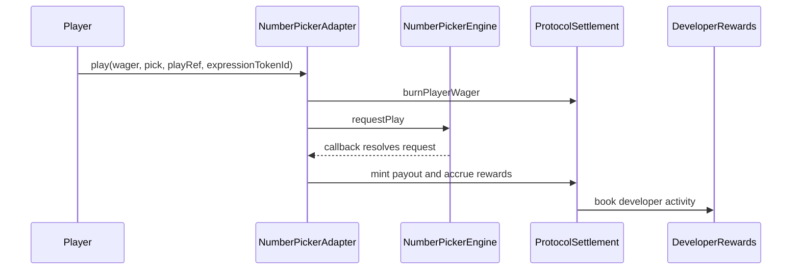
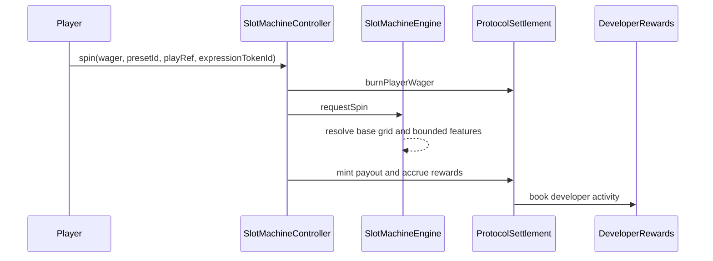

# Game Module User Flows

Scuro currently ships two canonical solo modules.

| Module | Controller | Engine | Randomness | Canonical config |
| --- | --- | --- | --- | --- |
| NumberPicker | `NumberPickerAdapter` | `NumberPickerEngine` | VRF coordinator | `number-picker-auto` |
| SlotMachine | `SlotMachineController` | `SlotMachineEngine` | VRF coordinator | `base`, `free`, `pick`, `hold` presets |

## NumberPicker

## SlotMachine

## Lifecycle

- `LIVE`: starts and settlement are allowed.
- `RETIRED`: new starts are blocked; in-flight settlement remains allowed.
- `DISABLED`: starts and settlement are blocked.
