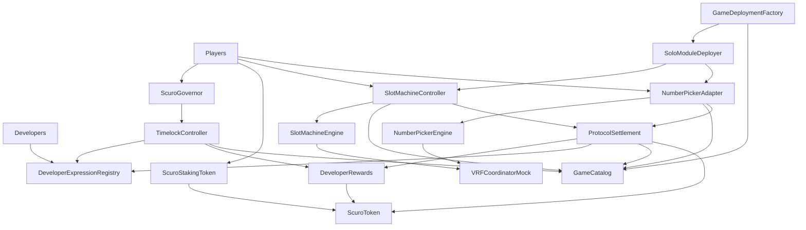

# Scuro Protocol Architecture

Scuro is now a focused solo-RNG protocol: a shared settlement, governance, catalog, and developer reward core with two canonical modules, `NumberPicker` and `SlotMachine`.

## Layers

### Governance And Token Core

`ScuroToken`, `ScuroStakingToken`, `ScuroGovernor`, and `TimelockController` provide the economic asset, staking power, and delayed administrative path for catalog and reward changes.

### Protocol Services

`ProtocolSettlement` is the only shared value movement surface. It validates catalog authorization, burns wagers, mints payouts, and books developer rewards against active expression NFTs.

`GameCatalog` stores each module as a controller/engine pair with engine type, config hash, developer reward basis points, and lifecycle status. `RETIRED` blocks new starts while allowing settlement; `DISABLED` halts progress.

`GameDeploymentFactory` only deploys `SoloFamily.NumberPicker` and `SoloFamily.SlotMachine`, returning `(moduleId, controller, engine)`.

### Controllers And Engines

`NumberPickerAdapter` and `SlotMachineController` are player entrypoints. They burn wagers through settlement, invoke their engines, preserve expression token attribution, and finalize payouts.

`NumberPickerEngine` and `SlotMachineEngine` hold gameplay rules and randomness handling. Slot presets are governed engine configs, with canonical `base`, `free`, `pick`, and `hold` presets supplied by `SlotMachinePresets`.

## Code Map

- Core services: `src/ProtocolSettlement.sol`, `src/GameCatalog.sol`, `src/GameDeploymentFactory.sol`
- Economics and governance: `src/ScuroToken.sol`, `src/ScuroStakingToken.sol`, `src/ScuroGovernor.sol`, `src/DeveloperExpressionRegistry.sol`, `src/DeveloperRewards.sol`
- Controllers: `src/controllers/NumberPickerAdapter.sol`, `src/controllers/SlotMachineController.sol`
- Engines: `src/engines/NumberPickerEngine.sol`, `src/engines/SlotMachineEngine.sol`
- Deployment: `script/DeployLocal.s.sol`, `script/aws/Deploy*.s.sol`
- Tests: `test/`, `test/e2e/`, `test/invariants/`
