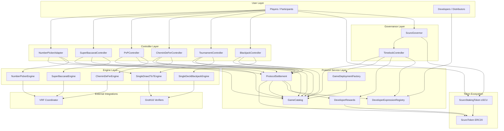

# Scuro Protocol Architecture

Scuro is a high-performance, shared settlement and governance layer designed to host a diverse array of game-specific controllers and engines. By unifying these components under a single protocol asset, Scuro provides a standardized economic infrastructure that simplifies game development and ensures cross-game compatibility.

The current implementation showcases this versatility through a variety of modules:
- **VRF-backed Solo Play**: A foundational example of provably fair single-player interaction.
- **EV-Neutral Baccarat**: Automated solo and player-banked baccarat modules built around a shared rules library and VRF-backed fresh shoes.
- **ZK-Proven Poker & Blackjack**: Advanced examples leveraging Groth16 proof verification for secure, private gameplay.
- **Developer Attribution**: A robust system using transferable "Expression NFTs" and a centralized Catalog/Factory pair to manage module registration and reward distribution.

---

## High-Level Architecture

The following diagram illustrates the layered approach Scuro takes to separate concerns, from user interaction down to the core token ecosystem.

---

## Layer Breakdown

### Governance & Token Ecosystem
The foundation of the protocol ensures economic stability and decentralized control.
- **`ScuroToken` (`SCU`)**: The lifeblood of the protocol, used for all wagers, rewards, and payouts.
- **`ScuroStakingToken` (`sSCU`)**: Allows participants to stake their `SCU`, providing both liquidity and a voice in the protocol's future through governance.
- **`ScuroGovernor` & `TimelockController`**: These contracts manage the protocol's evolution, allowing the community to adjust parameters like reward durations and moderation roles.

### Controllers
Controllers are the entry points for players, orchestrating the lifecycle of specific game modes.
- **Mode-Specific Logic**: From solo play (`NumberPickerAdapter`) to complex multi-player tournaments (`TournamentController`), controllers manage the transition from user action to engine execution.
- **Mode-Specific Logic**: From solo play (`NumberPickerAdapter`, `SuperBaccaratController`) to banker-opened many-player tables (`CheminDeFerController`) and complex tournaments (`TournamentController`), controllers manage the transition from user action to engine execution.
- **Attribution Persistence**: They track the `expressionTokenId` across multi-step flows, ensuring that developers receive their rightful rewards upon settlement.

### Protocol Services
The "brains" of Scuro, these services handle high-level logic and value settlement.
- **`ProtocolSettlement`**: The ONLY contract authorized to move value. It acts as a secure clearinghouse, verifying controller authorization via the `GameCatalog` before burning wagers or minting rewards.
- **`GameCatalog`**: The source of truth for all authorized game modules. It stores metadata, reward rates, and enforces lifecycle statuses (`LIVE`, `RETIRED`, `DISABLED`).
- **`GameDeploymentFactory`**: A utility for standardizing the deployment and registration of new game modules.
- **`DeveloperExpressionRegistry`**: A permissionless registry where developers mint NFTs representing their logic, enabling transferable reward attribution.
- **`DeveloperRewards`**: Manages the accumulation and distribution of inflationary rewards to developers across defined epochs.

### Engines & Integrations
Engines contain the pure rules of the game, isolated from economic logic.
- **Game Integrity**: Engines handle the core "physics" of the game, whether it's evaluating a poker hand or processing blackjack actions.
- **Game Integrity**: Engines handle the core "physics" of the game, whether it's evaluating a poker hand, resolving baccarat tableau draws, or processing blackjack actions.
- **External Signals**: They interface with external providers like VRF coordinators for randomness or Groth16 verifiers for zero-knowledge proofs.

---

## Value and Control Flow

1.  **Direct Interaction**: Players interact with **Controllers**, never with the **Settlement** layer directly.
2.  **Catalog Gating**: Controllers consult the **Catalog** to ensure a module is authorized for play before a session begins.
3.  **Engine Autonomy**: Engines focus solely on game rules and proof requirements, ensuring logic remains separated from value flow.
4.  **Centralized Settlement**: Value movement is consolidated in **ProtocolSettlement**, which enforces strict authorization and attribution rules.
5.  **Dynamic Attribution**: Rewards follow the current owner of a developer's **Expression NFT**, allowing for secondary markets or organizational transfers of developer streaks.

---

## Code Map

- **Core Primitives**: `src/ScuroToken.sol`, `src/ScuroStakingToken.sol`, `src/ScuroGovernor.sol`
- **Protocol Services**: `src/ProtocolSettlement.sol`, `src/GameCatalog.sol`, `src/GameDeploymentFactory.sol`, `src/DeveloperExpressionRegistry.sol`, `src/DeveloperRewards.sol`
- **Gameplay Entrypoints**: `src/controllers/`
- **Game Logic**: `src/engines/`
- **ZK & Verification**: `src/verifiers/`, `zk/`
- **Deployment & Integration**: `script/`, `test/e2e/`

---

## Operational Notes

- **Lifecycle Management**: The `RETIRED` status allows for graceful decommissioning of modules—blocking new sessions while allowing in-flight games to settle. `DISABLED` acts as an emergency stop, halting all progress.
- **Attribution Enforcement**: Reward compatibility is checked at settlement time, meaning developers must ensure their expressions remain active and correctly configured throughout a game's lifecycle.
- **Transferable Rewards**: Because expression NFTs are transferable, long-running sessions (like tournaments) will always reward the entity that owns the logic at the moment of final settlement.
