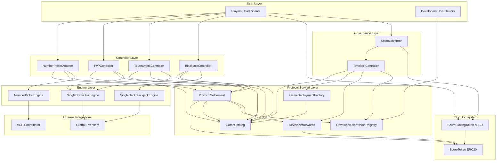

# Scuro Protocol Architecture

Scuro is a shared settlement and governance layer that hosts multiple game-specific controllers and engines behind a single protocol asset. The current implementation includes a VRF-backed solo example plus poker and blackjack examples that rely on Groth16 proof verification, with developer attribution handled through transferable expression NFTs and module registration handled through a catalog/factory pair.

Next step after this page: use [Local Deployment and Testing](./local-deployment-testing.md) when you need commands, deployment workflow, or suite selection.

## High-Level Architecture

## Layer Breakdown

### Governance and tokens

- `ScuroToken` (`SCU`) is the protocol asset used for wagers, rewards, and developer payouts.
- `ScuroStakingToken` (`sSCU`) wraps staked SCU and provides governance voting power.
- `ScuroGovernor` plus `TimelockController` govern live protocol configuration such as developer reward epoch duration and expression moderation roles.

### Controllers

- `NumberPickerAdapter` handles solo VRF-backed play and immediate settlement finalization.
- `TournamentController` creates tournaments, starts poker matches, and settles reported tournament outcomes.
- `PvPController` creates direct two-player poker sessions and settles completed matches.
- `BlackjackController` opens blackjack hands, burns any extra wager for doubles or splits, and settles completed hands.
- `BaseSoloController` holds the shared solo-controller logic for catalog gating, settlement calls, and expression-token persistence.
- Every gameplay entrypoint carries an `expressionTokenId`; multi-step controllers persist it so settlement can attribute rewards later.

### Protocol services

- `ProtocolSettlement` is the only protocol-level contract allowed to burn player wagers, mint player rewards, and accrue developer rewards. It authorizes callers by checking whether the calling controller is settlable in `GameCatalog`.
- `GameCatalog` stores module metadata: play mode, controller, engine, verifier address, config hash, `developerRewardBps`, and module status.
- `GameDeploymentFactory` is the module bootstrap helper that deploys supported controllers, engines, and verifier bundles, then registers the resulting module in `GameCatalog`.
- `DeveloperExpressionRegistry` is a permissionless ERC721 registry for developer-owned engine expressions bound to `engineType`.
- `DeveloperRewards` accumulates developer inflation by epoch and handles post-close claims.
- Module lifecycle is status-based:
  - `LIVE`: launchable and settlable
  - `RETIRED`: not launchable, still settlable for in-flight games
  - `DISABLED`: neither launchable nor settlable

### Engines and integrations

- `NumberPickerEngine` is the simple solo engine and depends on a VRF coordinator mock in local and dev flows.
- `SingleDraw2To7Engine` is the poker engine implementation used by both tournament and PvP modules. Each module now deploys its own engine instance with immutable blind, timeout, verifier, and coordinator settings.
- `SingleDeckBlackjackEngine` is the solo zk blackjack engine. The controller opens sessions while a zk coordinator proves the initial deal, action resolution, and showdown.
- Poker and blackjack both depend on Groth16 verifier bundles wired into the deployed stack.

## Value And Control Flow

- Players enter through controllers or the staking token, not through settlement directly.
- Controllers consult the catalog to ensure their module is launchable before starting new gameplay and settlable before finishing existing gameplay.
- Engines own rules, proof or randomness requirements, and game-specific state transitions.
- Gameplay calls supply an `expressionTokenId`; multi-step flows store it first and reuse it at final settlement.
- Settlement centralizes value movement by burning wagers, minting payouts, and recording developer reward accruals.
- Settlement enforces controller authorization, expression active status, and engine-type compatibility at accrual time by reading module metadata from `GameCatalog`.
- Developer accrual follows the current owner of the expression NFT when settlement books activity.
- Governance modifies live protocol settings through the governor and timelock rather than per-engine manual intervention, and can also own catalog/factory roles for module deployment and lifecycle changes.

## Code Map

- `src/ScuroToken.sol`, `src/ScuroStakingToken.sol`, `src/ScuroGovernor.sol`: token and governance primitives.
- `src/ProtocolSettlement.sol`, `src/GameCatalog.sol`, `src/GameDeploymentFactory.sol`, `src/DeveloperExpressionRegistry.sol`, `src/DeveloperRewards.sol`: shared protocol service layer.
- `src/controllers/`: controller and adapter entrypoints for solo, tournament, PvP, and blackjack flows.
- `src/engines/`: game-specific rule engines.
- `src/verifiers/` and `zk/`: verifier bundles, generated verifier contracts, circuits, fixtures, and zk artifacts.
- `script/DeployLocal.s.sol` and `script/e2e_deploy_smoke.sh`: local stack deployment and smoke verification entrypoints.
- `test/e2e/`: end-to-end scenario suites and coverage matrix.

## Operational Notes

- `RETIRED` modules block new sessions but still allow coordinator completions and settlement for games that already started.
- `DISABLED` modules block both new sessions and settlement progress.
- Expression compatibility is enforced when settlement books accrual, so a deactivated or mismatched expression can surface at settlement time for long-running flows.
- Expression NFTs are transferable; long-running sessions follow the expression owner at final settlement.
- The zk-backed engines still rely on an off-chain coordinator for proof generation and submission.
